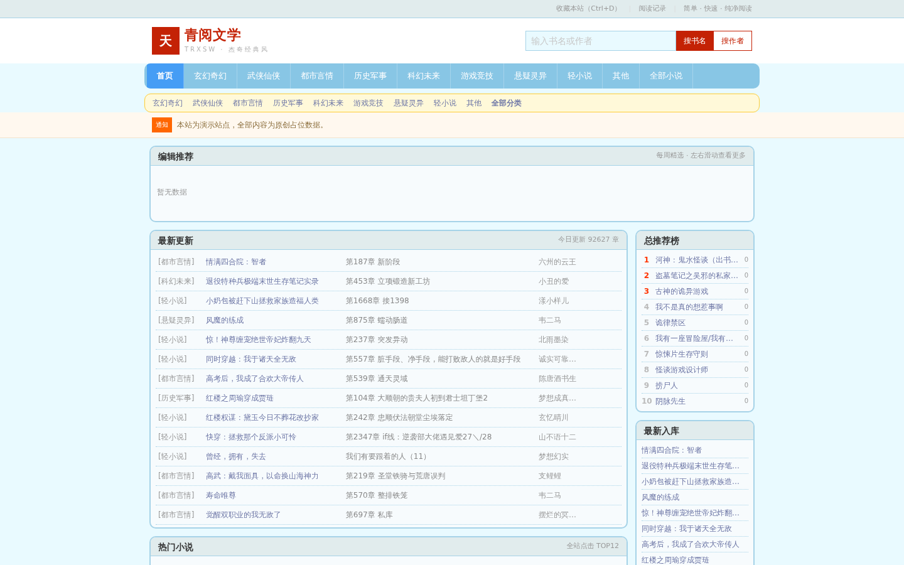
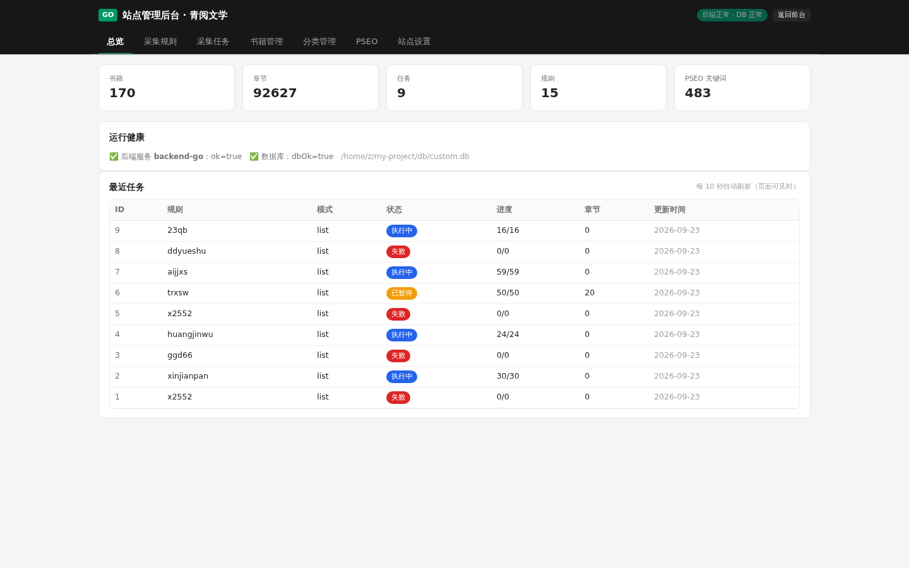
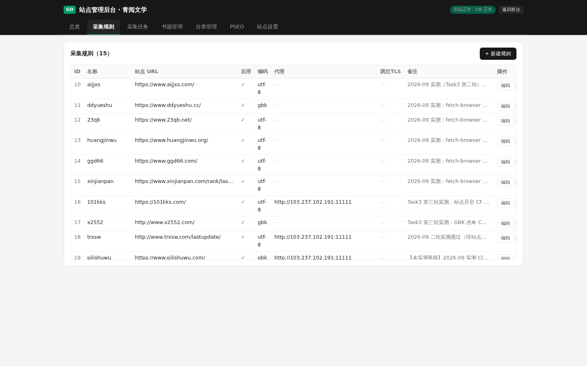
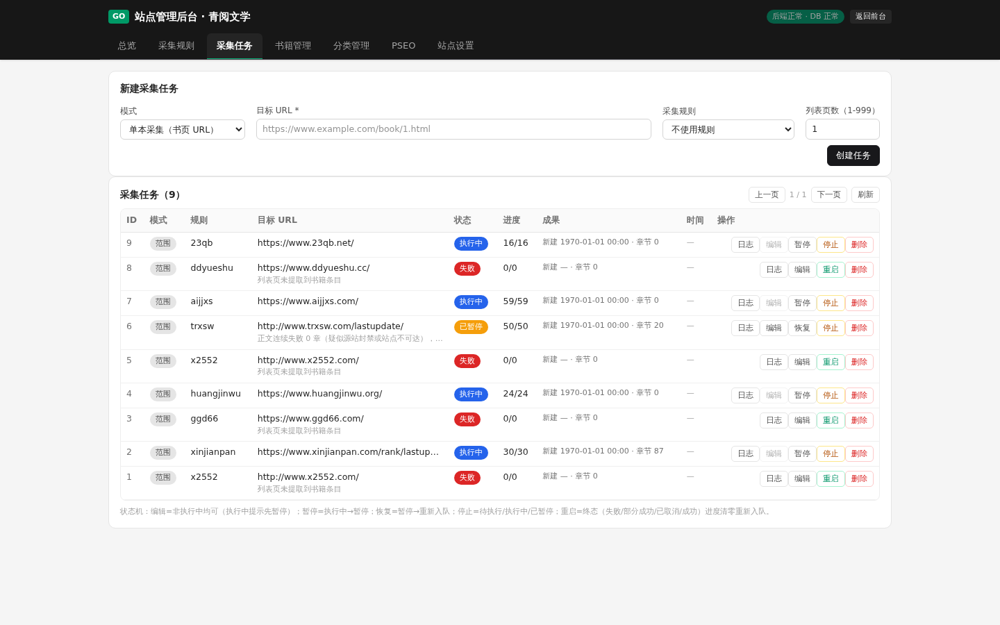
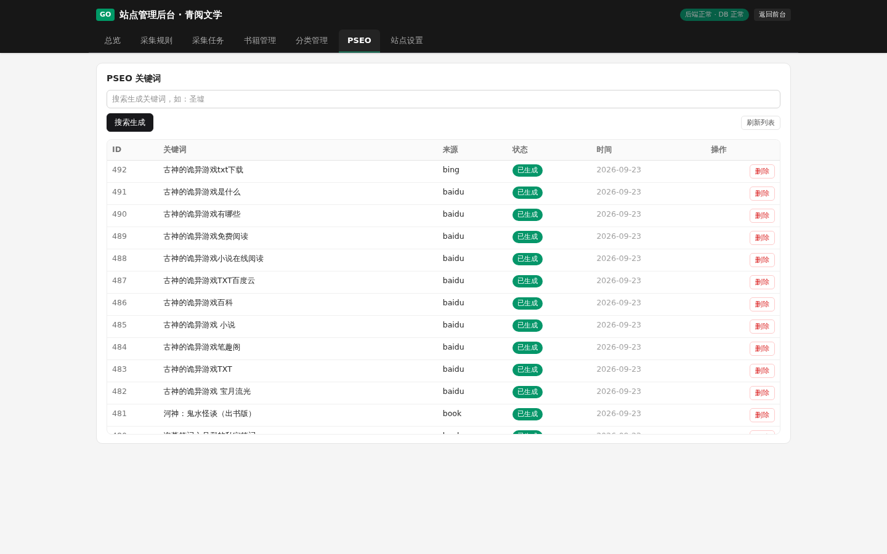
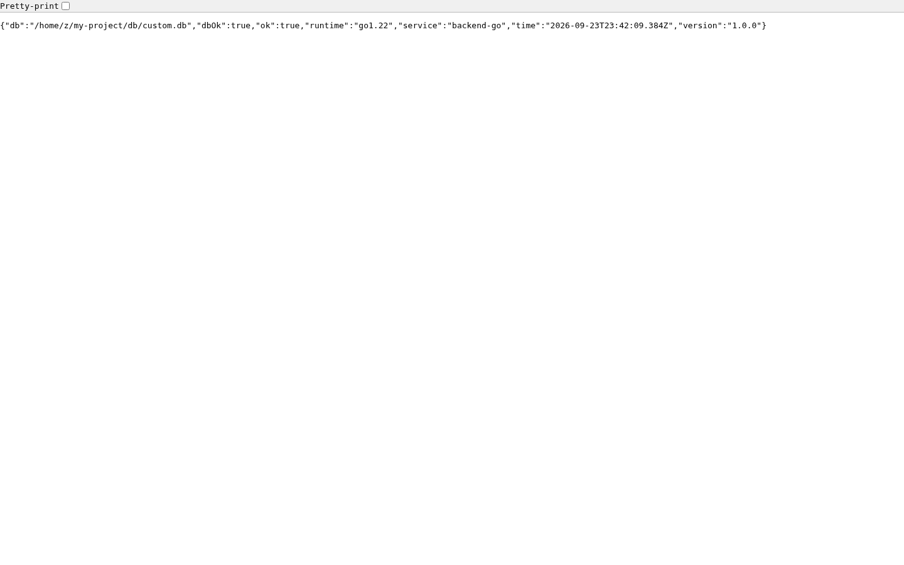
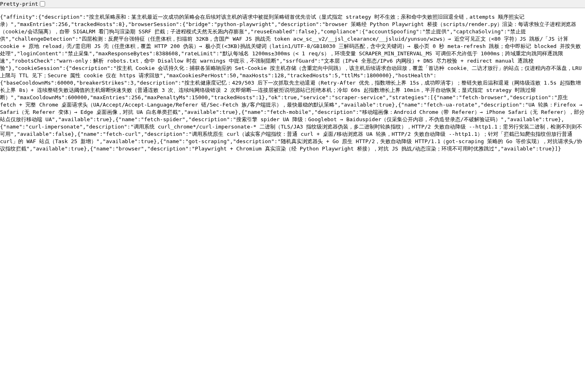

# novel-admin 安装部署图文教程（全 Go 架构 · 从零开始）

> 适用架构：**Task 27 之后的终态** —— 全 Go 双进程：
> **backend-go**（:3000，页面 SSR + 业务 API + 采集 runner + 空库自动播种，四合一单进程）
> ＋ **scraper-go**（:3030，反反爬采集引擎）。
> **Next.js 已彻底拆除**（无 `src/`、无 `next` 依赖、无 Node 运行时参与线上服务）。
>
> 本教程面向**零基础读者**：假设你刚拿到一台全新 Ubuntu 22.04 服务器，从装系统工具开始，每一步都给出
> **目的说明 → 完整命令（含预期输出）→ 常见报错与解决 → 验证方法**。照着从上往下抄即可完成部署。
>
> 约定：示例中项目根目录统一为 `/opt/novel-admin`（请按实际替换）；`#` 开头为注释行；
> 涉及密钥一律用 `<YOUR_TOKEN>` 占位，**请替换为你自己的值，切勿把真实 token 写进任何文件**。
>
> 专题文档：[采集规则分析（15 站实测）](scrape-rules.md) · [反反爬技术选型](anti-anti-crawl.md)

---

## 目录

1. [架构总览（先看懂要部署什么）](#1-架构总览先看懂要部署什么)
2. [环境准备：系统要求与依赖安装](#2-环境准备系统要求与依赖安装)
3. [获取代码：git clone](#3-获取代码git-clone)
4. [项目配置：环境变量](#4-项目配置环境变量)
5. [构建项目：bun install + build-go.sh](#5-构建项目bun-install--build-gosh)
6. [数据库初始化：自动建表 + 种子自动播种](#6-数据库初始化自动建表--种子自动播种)
7. [启动服务：bun run dev / 手动 / systemd](#7-启动服务bun-run-dev--手动--systemd)
8. [反向代理与 HTTPS（Nginx / Caddy）](#8-反向代理与-httpsnginx--caddy)
9. [部署验证清单 + 采集冒烟测试](#9-部署验证清单--采集冒烟测试)
10. [日常运维：日志 / 重启 / 备份 / 升级](#10-日常运维日志--重启--备份--升级)
11. [故障排查](#11-故障排查)
12. [附录：目录结构 / 端口清单 / 环境变量 / FAQ](#12-附录)

---

## 1. 架构总览（先看懂要部署什么）

### 1.1 一句话架构

```
浏览器 ──► Nginx/Caddy（80/443，可选）──► backend-go :3000（唯一对外入口）
                                              │
              ┌───────────────────────────────┼──────────────────────────┐
              │                               │                          │
        页面渲染（SSR）                   业务 API                    采集 runner
   web/templates/ 10 主题              /api/novels 等            worker.go：2s 轮询任务
   + /admin 管理后台                  + /api/health              + 每 ≈30s 互监护引擎
              │                               │                          │
              └───────────────► SQLite db/custom.db ◄────────────────────┘
                                    ▲
                       空库自动播种：15 规则 / 9 分类 / 首页三区块
                                     （go:embed 进二进制，无需数据文件）

backend-go ──HTTP──► scraper-go :3030（采集引擎，8 策略链 / GBK 解码 / 限速 / SSRF 防护）
                              └──► 目标小说站（公开页面）
```

要点：

- **3000 端口是唯一对外入口**，由 backend-go 直接承载（页面 + API + runner 同进程）；
  scraper-go :3030 只服务内部采集调用，**不需要**对公网开放。
- **SQLite 单库单写者**：`db/custom.db` 是唯一存储，backend-go 是唯一业务写入方
  （Go 侧用 `modernc.org/sqlite` 纯 Go 驱动直连，免 CGo；表结构权威参考 `prisma/schema.prisma`）。
- **空库自动播种**：全新部署**不需要任何预置数据文件**——首次启动检测到规则/分类空表，
  自动从内嵌种子恢复 15 条采集规则、9 个分类与首页三区块配置（详见 §6.2）。
- **历史残响**：Next.js 代理层、3007 双保险、`GO_WEB_ORIGIN` / `BACKEND_WATCH_DEV` 等
  旧配置均已退役，**设置了也不会生效**；`BACKEND_PORT=3005` 仅作迁移期兼容值，新部署一律 3000。

### 1.2 组件职责表

| 组件 | 端口 | 运行时 | 职责 | 源码目录 |
|------|------|--------|------|----------|
| backend-go | **3000**（`BACKEND_PORT` 可覆盖） | Go ≥1.22 | 页面 SSR + 业务 API + 采集 runner + 空库播种（`BACKEND_MODE=all`） | `mini-services/backend-go/` |
| scraper-go | 3030（`SCRAPER_PORT` 可覆盖） | Go ≥1.22 | 反反爬引擎：8 策略链、GBK/GB18030 解码、域名限速、SSRF 防护 | `mini-services/scraper-go/` |
| SQLite | — | — | 唯一存储 `db/custom.db`（WAL + busy_timeout 5s） | `db/` |
| Prisma CLI | — | Bun | 仅**建表/同步表结构**（`bun run db:push`）与生成工具用客户端；不参与线上服务 | `prisma/` |
| scraper-service | — | TS（**已退役**） | 旧 TS 引擎，仅作回滚备份；默认启动会被自守卫拒绝（防止与 Go runner 双写任务） | `mini-services/scraper-service/` |

### 1.3 看护关系（谁拉起谁）

```
 开发/沙箱形态：
   bun run dev ─► scripts/dev-go.sh（自愈循环：backend-go 退出 2s 后重拉 + 防双实例预检）
        │
        ▼
   backend-go :3000 ──每 ≈30s 探测 :3030（互监护）──► scraper-go :3030
   二级兜底：scripts/ensure-services.sh（可挂 cron 每分钟，3000/3030 不通才拉起）

 生产形态（推荐）：
   systemd 双 unit（novel-backend.service + novel-scraper.service）+ Restart=always
   取代上述全部兜底循环（见 §7.3）
```

### 1.4 最终效果预览（真实截图）

**前台首页**（当前启用主题的服务端渲染首页，书封卡 + 分类导航 + 图文区块）：



**管理后台 · 总览**（`/admin`，7 个 tab：总览 / 采集规则 / 采集任务 / 书籍管理 / 分类管理 / PSEO / 站点设置）：



---

## 2. 环境准备：系统要求与依赖安装

### 2.1 服务器要求

| 项目 | 最低要求 | 建议 | 说明 |
|------|----------|------|------|
| 操作系统 | Ubuntu 22.04 LTS（x86_64） | 同左（Debian 12 亦可） | 本教程命令按 Ubuntu 22.04 编写 |
| CPU | 2 核 | 4 核 | 采集高峰期 runner + 引擎同时工作 |
| 内存 | 2 GB | 4 GB + 2 GB swap | Go 进程常驻约 100~300MB；SQLite/封面下载有峰值 |
| 磁盘 | 10 GB | 20 GB+ | 正文全部存 SQLite，长期采集需预留空间 |
| 网络 | 能访问目标小说站与软件源 | — | 国内服务器建议配 GOPROXY（§2.4） |

### 2.2 系统更新与基础工具

**目的**：装齐 `curl / git / tar / sqlite3` 等基础工具，后续每一步都会用到。

```bash
sudo apt update && sudo apt upgrade -y
sudo apt install -y curl git tar gzip sqlite3 build-essential
```

预期输出（节选）：

```
Hit:1 http://archive.ubuntu.com/ubuntu jammy InRelease
Reading package lists... Done
```

**验证**：

```bash
git --version     # → git version 2.34.1（≥2.30 即可）
sqlite3 --version # → 3.37.2 ...（≥3.30 即可）
```

常见报错：

| 报错 | 解决 |
|------|------|
| `sudo: command not found` | 你可能正以 root 登录：去掉所有 `sudo` 直接执行 |
| `Unable to locate package sqlite3` | 先跑 `sudo apt update` 刷新索引；仍失败检查 `/etc/apt/sources.list` |

### 2.3 安装 Go 1.22+（backend-go / scraper-go 编译运行必需）

**目的**：两个服务的 go.mod 均声明 `go 1.22`，需要 Go ≥1.22 工具链编译。

**方式 A（国内服务器，阿里云镜像，推荐）**：

```bash
# ① 下载 Go 1.22.10（阿里云镜像，约 65MB）
curl -sL -o /tmp/go.tgz https://mirrors.aliyun.com/golang/go1.22.10.linux-amd64.tar.gz

# ② 解压到 /usr/local（产物：/usr/local/go/bin/go）
sudo rm -rf /usr/local/go && sudo tar -C /usr/local -xzf /tmp/go.tgz

# ③ 写入 PATH（永久生效：写进 ~/.bashrc）
echo 'export PATH=$PATH:/usr/local/go/bin' >> ~/.bashrc
echo 'export GOPROXY=https://goproxy.cn,direct' >> ~/.bashrc
source ~/.bashrc
```

**方式 B（海外服务器，官方源）**：

```bash
curl -sL -o /tmp/go.tgz https://go.dev/dl/go1.22.10.linux-amd64.tar.gz
sudo rm -rf /usr/local/go && sudo tar -C /usr/local -xzf /tmp/go.tgz
echo 'export PATH=$PATH:/usr/local/go/bin' >> ~/.bashrc && source ~/.bashrc
```

**验证**：

```bash
go version
# 预期输出：
go version go1.22.10 linux/amd64
```

常见报错：

| 报错 | 解决 |
|------|------|
| `go: command not found` | PATH 没生效：`echo $PATH | grep go`；确认 `ls /usr/local/go/bin/go` 存在后重开终端或 `source ~/.bashrc` |
| 解压后 `go version` 报 `exec format error` | 架构不对：`uname -m` 确认是 `x86_64`（ARM 服务器请下 `linux-arm64` 包） |
| 首次 `go build` 卡在下载依赖 | 未设 GOPROXY：`go env -w GOPROXY=https://goproxy.cn,direct` |
| `go: download timeout` | 同上，goproxy.cn 或公司内网代理 |

> 说明：仓库内两个 `run.sh`（`mini-services/*/run.sh`）会自动把 `/home/z/go-sdk/go/bin`
> 追加进 PATH（沙箱环境的 Go 安装位置），你的机器装在 `/usr/local/go` 时二者并存、互不影响。

### 2.4 安装 Bun（依赖安装 / CSS 构建 / 运维脚本运行器）

**目的**：项目虽已是全 Go，但仍需要 Bun 完成 3 件事（为什么详见 §5.1）：
① `bun install` 装 Prisma CLI + Tailwind 依赖；② `bun run build:css` 构建 Tailwind CSS；③ 充当 `bun run dev/build` 命令入口。

```bash
curl -fsSL https://bun.sh/install | bash
# 预期输出（节选）：
# bun was installed successfully!
#   ~version: v1.3.x
echo 'export PATH="$HOME/.bun/bin:$PATH"' >> ~/.bashrc
source ~/.bashrc
```

国内服务器若 `bun.sh` 不可达，可用 npm 镜像安装（需先有 Node/npm，任选其一）：

```bash
sudo npm i -g bun --registry=https://registry.npmmirror.com
```

**验证**：

```bash
bun --version
# 预期输出：
1.3.14
```

常见报错：

| 报错 | 解决 |
|------|------|
| `curl: (7) Failed to connect` | 换上方 npm 镜像方式，或配置代理后重试 |
| `bun: command not found` | `~/.bun/bin` 未进 PATH，重看第 ② 步 echo 是否执行 |

### 2.5 安装 curl-impersonate（可选，硬反爬站必备）

**目的**：引擎的 `curl-impersonate` / `fetch-curl` 策略依赖这组 TLS 指纹伪装二进制
（对 Cloudflare 类指纹检测站点是唯一突破口）。不装也能跑，只是这两条策略不可用。

```bash
bash scripts/install-curl-impersonate.sh
# 预期输出：
# installed: 21 binaries
ls ~/.local/bin | head    # → curl_chrome116 / curl_ff117 / ... 共 21 个
```

- 引擎按 PATH 查找这些二进制，确保 `~/.local/bin` 在 PATH 中：
  `echo 'export PATH="$HOME/.local/bin:$PATH"' >> ~/.bashrc`
- 引擎启动时若未装，该策略标记不可用；**装好后无需重启引擎**（60s 自动重探），
  `GET :3030/api/strategies` 中 `curl-impersonate` 会自动变为 `"available":true`。

常见报错：

| 报错 | 解决 |
|------|------|
| 下载超时 | 脚本走 GitHub releases，国内可重试几次或手动下载 release 包解压到 `~/.local/bin` |
| 策略仍不可用 | 确认引擎进程的 PATH 包含 `~/.local/bin`（systemd 部署见 §7.3 的 `Environment=PATH=` 行） |

### 2.6 防火墙端口规划

**目的**：只放行必要端口，:3000/:3030 留在本机。

| 端口 | 用途 | 对公网开放？ |
|------|------|--------------|
| 22 | SSH | 是 |
| 80 / 443 | Nginx/Caddy（反代 backend-go） | 是 |
| **3000** | backend-go（页面+API） | **否**（经反代访问；无反代时临时开放调试） |
| **3030** | scraper-go 引擎 | **否**（仅 backend-go 内网调用） |

```bash
sudo ufw allow OpenSSH && sudo ufw allow 80/tcp && sudo ufw allow 443/tcp
sudo ufw enable && sudo ufw status
```

---

## 3. 获取代码：git clone

**目的**：把仓库拉到服务器。以下按「公开仓库 / 私有仓库 HTTPS token / SSH」三种场景给出，
**任选其一**。

### 3.1 公开仓库

```bash
cd /opt
git clone https://github.com/<YOUR_ACCOUNT>/novel-admin.git novel-admin
cd novel-admin
git log --oneline -1   # 确认拉到最新提交
```

### 3.2 私有仓库（HTTPS + Personal Access Token）

GitHub 已不支持密码式 HTTPS 拉取，改用 PAT（Personal Access Token）。⚠️ **token 只出现在
命令行/临时凭据里，严禁写进 README、文档或提交进仓库**：

```bash
# 方式一：clone 时一次性内嵌（注意：该 URL 会进入 shell history 与 git remote 配置）
git clone https://<YOUR_ACCOUNT>:<YOUR_TOKEN>@github.com/<YOUR_ACCOUNT>/novel-admin.git novel-admin

# 方式二（推荐）：credential helper 存储，remote 配置里不留 token
git clone https://github.com/<YOUR_ACCOUNT>/novel-admin.git novel-admin
cd novel-admin
git config credential.helper store
git pull   # 首次会提示输入：Username → <YOUR_ACCOUNT>；Password → <YOUR_TOKEN>（此后自动记住）
```

> 安全提示：用方式一时，token 会留在 `.git/config` 与 `~/.bash_history` 里，
> 部署完成后建议 `git remote set-url origin https://github.com/<YOUR_ACCOUNT>/novel-admin.git`
> 清掉内嵌 token，改用 credential helper。

### 3.3 SSH 方式（已配 ssh-key 的场景）

```bash
git clone git@github.com:<YOUR_ACCOUNT>/novel-admin.git novel-admin
```

**验证**（三种方式通用）：

```bash
cd /opt/novel-admin && ls
# 预期输出（应看到以下关键项，说明拉取完整）：
# mini-services  prisma  db  docs  scripts  package.json  go 两模块...
```

常见报错：

| 报错 | 解决 |
|------|------|
| `Authentication failed` | token 过期/权限不足：PAT 需 `repo` 权限；或用户名填错（GitHub 用户名 ≠ 邮箱） |
| `fatal: repository not found` | 仓库名/账号拼错，或该账号无权访问私有仓库 |
| `Host key verification failed` | 首次 SSH 连接：`ssh -T git@github.com` 回答 yes 后重试 |

---

## 4. 项目配置：环境变量

### 4.1 先理解：谁读哪个配置

| 变量 | 谁在读 | 怎么配置才生效 |
|------|--------|----------------|
| `DATABASE_URL` | **Prisma CLI**（`bun run db:push` 建表用） | `.env` 文件（Prisma CLI 自动读取项目根 `.env`） |
| `DB_PATH` | **backend-go**（运行时读库路径） | 进程环境变量（shell export / systemd `Environment=`）；**注意 backend-go 不读 .env** |
| `BACKEND_PORT` | backend-go | 同上，缺省 3000 |
| `BACKEND_MODE` | backend-go | 同上，缺省 `all`（api\|runner\|all 三选一） |
| `SCRAPER_PORT` | scraper-go | 同上，缺省 3030 |
| `BACKEND_ENGINE_URL` | backend-go → 引擎地址 | 同上，缺省 `http://127.0.0.1:3030`（多引擎/测试实例时才需要改） |
| `COVERS_DIR` | backend-go 封面落盘目录 | 同上，缺省向上查找 `public/covers` |
| `SCRAPER_PYTHON` | scraper-go browser 策略 | 同上，自定义 python 路径；缺省从 PATH 找 |
| `SCRAPER_MIN_INTERVAL_MS` | scraper-go 域名限速 | 同上，缺省 1200，**不允许低于 1000** |
| `GOPROXY` | go 工具链 | shell / `go env -w`，国内必配 `https://goproxy.cn,direct` |

### 4.2 创建 .env（给 Prisma CLI 建表用）

```bash
cd /opt/novel-admin
mkdir -p db
cat > .env <<'EOF'
DATABASE_URL=file:/opt/novel-admin/db/custom.db
EOF
```

### 4.3 给运行进程准备环境变量（shell 部署形态）

如果用 §7.1/§7.2 的 shell 方式启动，把运行变量写进 profile：

```bash
cat >> ~/.bashrc <<'EOF'
export DB_PATH=/opt/novel-admin/db/custom.db
export BACKEND_PORT=3000
export BACKEND_MODE=all
export SCRAPER_PORT=3030
EOF
source ~/.bashrc
```

如果用 §7.3 的 systemd 生产部署，这些变量写进 unit 文件（见 §7.3，**不需要**写 ~/.bashrc）。

### 4.4 两条铁律

1. **两处路径必须指向同一个文件**：`DATABASE_URL`（建表）= `DB_PATH`（运行时）。
   建表建到 A 文件、运行读 B 文件，就会出现「表都建了启动却报 no such table」。
2. **backend-go 与 systemd 不读 .env**：`.env` 只服务 Prisma CLI；Go 进程的一切变量走
   shell export 或 systemd `Environment=`。

---

## 5. 构建项目：bun install + build-go.sh

### 5.1 为什么全 Go 项目还需要 `bun install`？

这是新同学最常问的问题，三个原因：

1. **CSS 构建链**：前台页面样式来自 Tailwind v4 扫描 **Go 模板**（`web/templates/**`）、
   静态 JS（`web/static/**`）与渐变 token 表（`web-src/gradient-tokens.txt`）生成的单个
   `web/static/css/tw.css`（约 170KB）。扫描/编译由 `scripts/build-web-css.mjs`（Bun 脚本）+
   `@tailwindcss/postcss` 完成。
2. **Prisma CLI 建表**：表结构权威在 `prisma/schema.prisma`，建库走 `bun run db:push`
   （prisma 命令行）；另有一个运维小工具 `scripts/engine-rule-test.mjs`（规则三段试测）
   依赖 Prisma Client 读库。
3. **命令入口**：`package.json` 的 `bun run dev / build / build:css` 是约定入口
   （分别映射到 `scripts/dev-go.sh` / `scripts/build-go.sh` / `scripts/build-web-css.mjs`）。

除此之外，**线上运行不依赖 Node/Bun**——两个 Go 二进制自包含。

### 5.2 安装依赖

```bash
cd /opt/novel-admin
bun install
```

预期输出（依赖极简：运行依赖 2 包 + 开发依赖 5 包）：

```
bun install v1.3.14
2 packages installed [1.2s]
```

`@prisma/client` 的 postinstall 会自动执行 `prisma generate`（生成 Prisma Client 供运维工具用）。
若日志提示未生成，手动补一刀：

```bash
bun run db:generate
```

常见报错：

| 报错 | 解决 |
|------|------|
| Prisma 引擎下载慢/超时 | 设镜像：`export PRISMA_ENGINES_MIRROR=https://registry.npmmirror.com/-/binary/prisma` 后重跑 |
| `EACCES` 权限错误 | 不要用 sudo 跑 bun install；确认目录属主是当前用户（`sudo chown -R $USER /opt/novel-admin`） |

### 5.3 一键构建：`bun run build`

```bash
bun run build   # = bash scripts/build-go.sh
```

预期输出：

```
[build-go] backend-go ...
[build-go] scraper-go ...
[build-go] tailwind css ...
[build-css] mini-services/backend-go/web-src/tw-input.css → mini-services/backend-go/web/static/css/tw.css (170.x KB)
[build-go] done
```

**build-go.sh 逐步解析**（对应脚本三段）：

| 步骤 | 命令 | 产物 | 说明 |
|------|------|------|------|
| ① 编译 backend-go | `cd mini-services/backend-go && go build -o backend-go.bin .` | `backend-go.bin`（≈19MB） | 页面 SSR+API+runner+seed 四合一；首次编译拉取 `modernc.org/sqlite`、`golang.org/x/image` 等模块（goproxy.cn 下约 1~2 分钟，之后有缓存秒级） |
| ② 编译 scraper-go | `cd mini-services/scraper-go && go build -o scraper-go.bin .` | `scraper-go.bin`（≈11MB） | 采集引擎；依赖 `goquery`/`golang.org/x/net` 等 |
| ③ 构建 Tailwind CSS | `bun run build:css` | `web/static/css/tw.css` | 扫描模板/静态 JS/gradient-tokens 中的类名 |

**验证**：

```bash
ls -lh mini-services/backend-go/backend-go.bin mini-services/scraper-go/scraper-go.bin mini-services/backend-go/web/static/css/tw.css
# 三个文件都应存在且 >1MB（tw.css 约 170KB）
```

### 5.4 手动等价命令（想脱离脚本逐步理解时）

```bash
export PATH=$PATH:/usr/local/go/bin
export GOPROXY=https://goproxy.cn,direct

# ① backend-go
cd /opt/novel-admin/mini-services/backend-go
go build -o backend-go.bin .

# ② scraper-go
cd ../scraper-go
go build -o scraper-go.bin .

# ③ Tailwind CSS
cd /opt/novel-admin
bun scripts/build-web-css.mjs
```

> 改了 Go 模板（`web/templates/**`）或静态 JS 后必须重跑第 ③ 步，否则新类名没有样式（§11.6）。
> `go build` 可加 `-trimpath -ldflags "-s -w"` 缩小二进制；`go vet ./...` / `go test ./...`
> 是提交前的标准自检。

---

## 6. 数据库初始化：自动建表 + 种子自动播种

### 6.1 建表：`bun run db:push`

**目的**：按 `prisma/schema.prisma` 在 SQLite 文件里创建全部 7 张表
（Novel / Chapter / Category / SiteSetting / ScrapeRule / ScrapeTask / PseoKeyword）。

```bash
cd /opt/novel-admin
bun run db:push    # = prisma db push --accept-data-loss
```

预期输出：

```
🚀  Your database is now in sync with your schema. Done in 1.2s
```

- ⚠️ `db:push` 对**已有库**有 schema 同步语义（可能删改列），生产库不要随手执行；
  全新空库首建无副作用。
- 空库场景（`db/custom.db` 不存在）会自动创建文件。

**验证**：

```bash
sqlite3 db/custom.db ".tables"
# 预期输出（7 张表）：
# Category      Chapter       Novel         PseoKeyword   ScrapeRule    ScrapeTask    SiteSetting
```

### 6.2 种子自动播种机制（无需任何数据文件）

**这套机制解决什么**：过去 15 条精心校准的采集规则只存在于数据库里，机器/沙箱回收后要人工从
git 快照救数据。现在规则资产**固化进二进制**：`seed/seed.json` 通过 `go:embed` 打包进
backend-go，启动时对应表为空即自动导入。

```
backend-go 启动
   │
   ├─ 打开 db/custom.db（WAL，DB_PATH 可覆盖）
   │
   ├─ startSeedIfEmpty()（seed.go）
   │     ├─ ScrapeRule 表 COUNT==0 ？──是──► 导入 15 条校准规则
   │     │                                    （11 老站多轮实测定稿 + 4 新站，
   │     │                                     含 fetch-curl/chapterListApi 增强标注）
   │     ├─ Category  表 COUNT==0 ？──是──► 导入 9 个分类
   │     │                                    （8 核心类 + 「其他」id=9999 sort=9999 恒末位）
   │     └─ SiteSetting.homeConfig 空？─是──► 写入默认首页三区块
   │                                          （小编精选 featured 8 本 上移契约位
   │                                           + 热门 12 + 最新上架 12）
   │
   └─ 监听 :3000，runner 开始 2s 轮询任务
```

**幂等语义（关键）**：只在 **`COUNT==0`** 时导入——你的任何编辑（改过规则、调过分类）
**永远不会被重启覆盖**；播种失败仅告警不阻断启动。
 SiteSetting 行本身由 API 层兜底 `INSERT OR IGNORE`，此处只补 homeConfig。

种子数据源：`mini-services/backend-go/seed/seed.json`（15 规则 + 9 分类 + site 三项 + homeBlocks）。
后台改完规则想「随仓库分发」，把新值同步回这份 JSON 即可（下次空库播种即为新版）。

### 6.3 验证播种结果

首次启动 backend-go（下一节）时，日志应出现：

```
[seed] ScrapeRule 空表 → 已播种 15 条校准规则
[seed] Category 空表 → 已播种 9 个分类（其他 id=9999 恒末位）
[seed] homeConfig 空 → 已写入默认 3 区块（小编精选上移契约位）
```

或直接查库：

```bash
sqlite3 db/custom.db "SELECT COUNT(*) FROM ScrapeRule;"   # → 15
sqlite3 db/custom.db "SELECT COUNT(*) FROM Category;"     # → 9
sqlite3 db/custom.db "SELECT id,name FROM Category ORDER BY sort LIMIT 9;"
# → 1 玄幻奇幻 / 2 武侠仙侠 / 3 都市言情 / 4 历史军事 / 5 科幻未来 / 6 游戏竞技 / 7 悬疑灵异 / 8 轻小说 / 9999 其他
```

> 手动重新播种：清空对应表（`DELETE FROM ScrapeRule;` 等）后重启服务即可。

---

## 7. 启动服务：bun run dev / 手动 / systemd

三选一按场景：**开发/验证 → §7.1；临时后台 → §7.2；生产 → §7.3**。

### 7.1 推荐路径：一条 `bun run dev`（自带自愈）

```bash
cd /opt/novel-admin
bun run dev   # = bash scripts/dev-go.sh
```

**dev-go.sh 自愈机制图解**：

```
bun run dev（dev-go.sh，前台驻留）
   │
   ├─ ① 健康预检：GET :3000/api/health
   │      已有 backend-go 实例 → 打印「已有实例，退出防双实例」并 exit 0
   │      （防双实例 = 防双 runner 同时轮询任务、双写 ScrapeTask）
   │
   └─ ② while true 自愈循环：
         bash mini-services/backend-go/run.sh      ← run.sh 内部：go build 增量编译 → 前台 exec backend-go.bin
         进程退出（崩溃/被杀）→ 记录 /tmp/dev-supervisor.log → sleep 2 → 重拉
```

启动成功的标志（run.sh 增量编译后）：

```
[backend-go] mode=all port=3000 db=/opt/novel-admin/db/custom.db
[backend-go] listening on :3000
```

**两级自动接力**（引擎不用手动启动）：

- runner 每 ≈30s（15 轮 × 2s）探测 `:3030/api/strategies`，不可达 → 杀残留 → setsid 托孤拉起
  `scraper-go.bin`（日志 `/tmp/engine.log`）；
- 更省事的第二条路：另开终端跑 `bash scripts/ensure-services.sh`（幂等兜底，可挂 cron 每分钟）。

> **为什么必须经 `bun run dev` 链路**：沙箱环境实测会周期回收交互 shell 直接派生的后台进程
> （setsid/nohup 均不保险），经沙箱 dev 链路（基础设施进程）孵化的进程才长寿稳定。
> 普通 VPS 无此限制，生产直接用 systemd（§7.3）。

**停止**：前台 `Ctrl-C`（自愈循环随之退出）；若只想重置 backend-go，可
`pkill -f 'backend-go[.]bin'`，循环 2s 后自动拉起新实例。

### 7.2 手动启动（不用 dev 循环，nohup 后台形态）

与 `scripts/ensure-services.sh` 同构：

```bash
cd /opt/novel-admin

# ① 先起引擎 → /tmp/engine.log
cd mini-services/scraper-go
setsid nohup env PATH="$HOME/.local/bin:$PATH" ./scraper-go.bin >> /tmp/engine.log 2>&1 </dev/null &

# ② 再起后端（all 模式）→ /tmp/backend-go-api.log
cd ../backend-go
setsid nohup env BACKEND_PORT=3000 BACKEND_MODE=all \
  DB_PATH=/opt/novel-admin/db/custom.db \
  ./backend-go.bin >> /tmp/backend-go-api.log 2>&1 </dev/null &
```

**验证**：`curl -s http://127.0.0.1:3000/api/health`（§9.1）。

### 7.3 生产部署：systemd 双进程（推荐）

两个 unit + `Restart=always`，看护语义与 dev 循环等价且更透明；3000 由 backend-go 直接承载，
**不需要第三个 unit**（Next 时代的产物已随架构退役）。

`/etc/systemd/system/novel-backend.service`：

```ini
[Unit]
Description=novel backend-go (SSR web + api + runner)
After=network.target

[Service]
Type=simple
WorkingDirectory=/opt/novel-admin/mini-services/backend-go
Environment=BACKEND_PORT=3000
Environment=BACKEND_MODE=all
Environment=DB_PATH=/opt/novel-admin/db/custom.db
ExecStart=/opt/novel-admin/mini-services/backend-go/backend-go.bin
Restart=always
RestartSec=2
# 安全加固（可选）：以非 root 运行
User=www-data
Group=www-data
# 内存护栏（可选，按机器规格调整）
Environment=GOMEMLIMIT=1800MiB

[Install]
WantedBy=multi-user.target
```

`/etc/systemd/system/novel-scraper.service`：

```ini
[Unit]
Description=novel scraper-go engine
After=network.target novel-backend.service

[Service]
Type=simple
WorkingDirectory=/opt/novel-admin/mini-services/scraper-go
Environment=SCRAPER_PORT=3030
# PATH 需包含 curl-impersonate 所在目录（~/.local/bin）
Environment=PATH=/home/deploy/.local/bin:/usr/local/bin:/usr/bin:/bin
ExecStart=/opt/novel-admin/mini-services/scraper-go/scraper-go.bin
Restart=always
RestartSec=2
User=www-data
Group=www-data

[Install]
WantedBy=multi-user.target
```

启用与查看：

```bash
sudo systemctl daemon-reload
sudo systemctl enable --now novel-backend.service novel-scraper.service
systemctl status novel-backend.service     # Active: active (running)
journalctl -u novel-backend.service -f     # 实时日志（替代 nohup 时代的 tail）
```

> 以 `User=www-data` 运行时，确保 `db/`、`public/covers/`、二进制目录对 www-data 可写：
> `sudo chown -R www-data:www-data /opt/novel-admin/db /opt/novel-admin/public`

---

## 8. 反向代理与 HTTPS（Nginx / Caddy）

backend-go 已渲染全部页面与 API，反代**直指 3000**，一跳即可。

### 8.1 Nginx 完整配置

```bash
sudo apt install -y nginx
sudo tee /etc/nginx/sites-available/novel-admin <<'EOF'
server {
    listen 80;
    server_name novel.example.com;            # ← 换成你的域名

    # 采集代理/上传类请求体放宽
    client_max_body_size 20m;

    location / {
        proxy_pass http://127.0.0.1:3000;
        proxy_http_version 1.1;
        proxy_set_header Host              $host;
        proxy_set_header X-Real-IP         $remote_addr;
        proxy_set_header X-Forwarded-For   $proxy_add_x_forwarded_for;
        proxy_set_header X-Forwarded-Proto $scheme;
        # 采集代理接口最长可 60s，放宽超时
        proxy_read_timeout  90s;
        proxy_send_timeout  90s;
    }
}
EOF
sudo ln -sf /etc/nginx/sites-available/novel-admin /etc/nginx/sites-enabled/
sudo nginx -t          # → syntax is ok / test is successful
sudo systemctl reload nginx
```

**验证**：浏览器 `http://novel.example.com` 出现首页；`curl -I http://novel.example.com/api/health` → 200。

### 8.2 HTTPS（Let's Encrypt 一条龙）

```bash
sudo apt install -y certbot python3-certbot-nginx
sudo certbot --nginx -d novel.example.com
# → Successfully received certificate（自动改写 nginx 配置 + 续期定时器）
sudo certbot renew --dry-run   # 验证自动续期
```

### 8.3 Caddy 方案（一个文件，自动 HTTPS）

```bash
sudo apt install -y debian-keyring debian-archive-keyring apt-transport-https
# …（按官方文档安装 caddy 后）编辑 /etc/caddy/Caddyfile：
```

```caddyfile
novel.example.com {
    reverse_proxy 127.0.0.1:3000 {
        header_up Host {host}
        header_up X-Real-IP {remote_host}
        header_up X-Forwarded-Proto {scheme}
    }
}
```

```bash
sudo systemctl reload caddy   # Caddy 自动申请/续期 HTTPS 证书
```

> 本仓库自带的 `Caddyfile`（`:81 → localhost:3000`）是沙箱预览面板的形态：本机 81 口反代
> 3000，生产可参考其 header 透传写法。

---

## 9. 部署验证清单 + 采集冒烟测试

### 9.1 命令行六连（全部通过 = 部署成功）

```bash
# ① 后端健康（核心指标：ok:true + dbOk:true）
curl -s http://127.0.0.1:3000/api/health
# 预期输出（db 字段 = 你的 DB_PATH 值；ok 与 dbOk 必须为 true）：
{"db":"/opt/novel-admin/db/custom.db","dbOk":true,"ok":true,"runtime":"go1.22",
 "service":"backend-go","time":"…","version":"1.0.0"}

# ② 引擎健康
curl -s http://127.0.0.1:3030/api/health
# 预期输出：
{"ok":true,"port":3030,"service":"scraper-service","time":"…"}

# ③ 页面/后台/SEO 路由状态码
for p in "/" "/admin" "/robots.txt" "/sitemap.xml"; do
  printf "%-14s -> " "$p"; curl -s -o /dev/null -w '%{http_code}\n' "http://127.0.0.1:3000$p"
done
# 预期输出（本环境实测）：
# /              -> 200
# /admin         -> 200
# /robots.txt    -> 200
# /sitemap.xml   -> 200

# ④ 引擎策略可用性（确认 8 策略链与 curl-impersonate 状态）
curl -s http://127.0.0.1:3030/api/strategies | head -c 400

# ⑤ 规则/分类已播种
curl -s http://127.0.0.1:3000/api/scrape-rules | python3 -c "import json,sys; print(len(json.load(sys.stdin)), 'rules')"
curl -s http://127.0.0.1:3000/api/categories   | python3 -c "import json,sys; print(len(json.load(sys.stdin)), 'categories')"

# ⑥ 双进程端口监听
ss -ltnp | grep -E ':(3000|3030)\b'
# → backend-go.bin :3000 / scraper-go.bin :3030
```

### 9.2 浏览器目验（真实截图）

**前台首页**：`http://<服务器IP或域名>/` —— 书封卡、分类导航（8 类 + 其他末位）、
「小编精选 / 热门小说 / 最新上架」三区块：


**管理后台**：`http://<服务器IP或域名>/admin` —— 总览统计卡（书籍/章节/规则/词数）与运行健康：


**采集规则 tab**（应有 15 条规则，可直接编辑 JSON 三段规则）：



**采集任务 tab**（任务列表、状态徽章、日志查看）：



**PSEO tab**（词表管理 / 批量生成）：



**健康检查 JSON**（`/api/health`，dbOk 即库连通）：



**引擎策略 JSON**（`:3030/api/strategies`，含合规约束与各策略描述）：



> 主题预览：任意页面加 `?theme=<主题名>` 即时切换（10 套主题：
> trxsw / 23qb / pilishuwu / ggd66 / aijjxs / x2552 / huangjinwu / 101kks / shipsay / ddyueshu）。

### 9.3 采集冒烟测试（下发一条小任务并观察）

**目的**：验证「后台 → runner → 引擎 → 目标站」全链路。

方式一（UI）：后台 → 采集任务 → 新建：`mode=list`、`pages=1`、选一条规则、填目标站列表页 URL → 提交。

方式二（API）：

```bash
# 下发（pages=1 只采一页列表，伤害最小）
curl -s -X POST http://127.0.0.1:3000/api/scrape-tasks \
  -H 'Content-Type: application/json' \
  -d '{"mode":"list","ruleId":14,"targetUrl":"https://<目标站列表页>/","pages":1}'
# 预期：HTTP 201，返回任务 JSON，status=pending，形如
# {"ok":true,"task":{"id":28,"mode":"list","status":"pending",...},"runner":"runner"}

# 2s 内 runner 领取 → running；观察进度（done/total 递增）
curl -s http://127.0.0.1:3000/api/scrape-tasks/28 | python3 -m json.tool | head
# 或后台「采集任务」tab 直接看状态徽章与日志

# 验证完可取消（协作式停止，不删已入库数据）
curl -s -X PATCH http://127.0.0.1:3000/api/scrape-tasks/28 \
  -H 'Content-Type: application/json' -d '{"action":"cancel"}'
```

判定要点：

| 现象 | 结论 |
|------|------|
| 任务 2s 内 pending → running | runner 正常（2s 轮询生效） |
| done 缓慢递增、日志有「采集/入库」记录 | 引擎链路正常（每域名限速 ≥1.2s，慢是设计行为） |
| 日志全是 challenge / 全策略失败 | 见 §11.5 采集失败分类排查 |
| `mode 必须是 single 或 list` 400 | 请求体字段错：mode/targetUrl/ruleId/pages 四个字段（ruleId 取规则 tab 里看到的 id） |

---

## 10. 日常运维：日志 / 重启 / 备份 / 升级

### 10.1 日志位置总表

| 日志 | 路径 | 内容 |
|------|------|------|
| backend-go（dev 链路） | `bun run dev` 前台输出（所见即所得） | 启动/播种/API/runner 全部关键日志 |
| backend-go（兜底拉起） | `/tmp/backend-go-api.log` | 同上（后台实例） |
| scraper-go | `/tmp/engine.log` | 引擎启动、策略尝试明细 |
| ensure-services 动作 | `/tmp/watchdog.log` | 兜底脚本每轮检查结论 |
| dev-go 退出记录 | `/tmp/dev-supervisor.log` | backend-go 退出码与重拉时刻 |
| runner 心跳 | `/tmp/scrape-runner-heartbeat` | 文件 mtime = runner 最近存活时刻（10s 内视为在线） |
| 任务级日志 | DB `ScrapeTask.log`（后台任务「日志」按钮） | 追加式（保留最近 100 行），逐书逐章成败 |
| systemd 形态 | `journalctl -u novel-backend.service` / `-u novel-scraper.service` | 两进程全部输出 |

### 10.2 重启方法（按启动形态对号入座）

```bash
# A. dev 循环形态（bun run dev 在跑）：只杀进程即可，2s 后自动重拉
pkill -f 'backend-go[.]bin'

# B. 手动 nohup 形态：杀掉后按 §7.2 重拉
pkill -f 'backend-go[.]bin'; pkill -f 'scraper-[g]o.bin'
# …按 §7.2 命令重新 setsid nohup 启动

# C. systemd 形态：
sudo systemctl restart novel-backend.service novel-scraper.service
```

> 重启安全语义：重启时遗留 `running` 任务自动转 `paused`（进度保留，后台可「恢复」续传，
> 骨架已入库的章节不会重复采集）；`pending` 任务保持不动，新 runner 起来 2s 内自动领取。

### 10.3 规则维护

- 规则在 `ScrapeRule` 表 / 后台「采集规则」tab；当前 15 条（11 老站 id 10-20 + 4 新站 id 21-24），
  站点实测结论见 [`scrape-rules.md`](scrape-rules.md)。
- 改完想「随仓库分发」：把新值同步回 `mini-services/backend-go/seed/seed.json`（空库播种源）。
- ⚠️ 后台规则表单是**全字段覆盖**式 PUT：传部分 JSON 会把未传的 bookRule/chapterRule 清空——
  改单字段也要带全量对象。
- 三段试测工具（直连 3030 引擎，不入库）：
  `bun scripts/engine-rule-test.mjs <规则名> <URL> [list|book|chapter]`（前置：`bun run db:generate`）。

### 10.4 数据备份与恢复

**备份对象**：`db/custom.db`（正文/规则/任务全在里面）+ `public/covers/`（封面图片）。
WAL 模式下库由 `custom.db + -shm + -wal` 三文件组成，**不要直接拷主文件**，用在线备份：

```bash
# 方式 A（推荐，热备单文件、免停服）：SQLite 在线备份 API
sqlite3 /opt/novel-admin/db/custom.db ".backup '/opt/backup/novel-$(date +%F).db'"

# 方式 B（冷备）：先停唯一写者再整体拷贝
sudo systemctl stop novel-backend.service
cp -av /opt/novel-admin/db/custom.db* /opt/backup/
sudo systemctl start novel-backend.service

# 封面随目录备份
tar czf /opt/backup/covers-$(date +%F).tgz /opt/novel-admin/public/covers

# 建议挂 cron：每天凌晨 3 点热备 + 保留 14 天
echo '0 3 * * * sqlite3 /opt/novel-admin/db/custom.db ".backup '\''/opt/backup/novel-$(date +\%F).db'\''" && find /opt/backup -name "novel-*.db" -mtime +14 -delete' | crontab -
```

**恢复（铁律：先停全部持有者，再替换文件）**：

```bash
# 多进程持有 WAL 时 mv/替换库文件 = 数据丢失（旧进程退出时按路径 unlink 新 wal）
sudo systemctl stop novel-backend.service novel-scraper.service
cp /opt/backup/novel-2025-01-01.db /opt/novel-admin/db/custom.db
sudo systemctl start novel-backend.service novel-scraper.service
# 核对：curl :3000/api/health（dbOk:true）→ 后台总览统计 → 规则 tab 核对 15 条
```

> 规则资产有种子兜底（§6.2）：即使库全空，重启即回填 15 规则/9 分类/三区块；
> 但种子只保「空表初值」，运行期的编辑仍需靠备份。

### 10.5 升级流程（拉新代码 → 重建 → 重启）

```bash
cd /opt/novel-admin
git pull                          # 私有仓库确保 credential helper 可用（§3.2）
bun install                       # package.json 有变更时同步依赖
bun run build                     # 双二进制 + tw.css 重建（增量，通常 <1 分钟）
sudo systemctl restart novel-backend.service novel-scraper.service
# dev 形态则：pkill -f 'backend-go[.]bin' 后由自愈循环重拉（run.sh 内置增量编译）
curl -s http://127.0.0.1:3000/api/health | grep -o '"ok":true'   # 收尾验证
```

> 升级不会动 `db/custom.db`；若新版本改了表结构，先备份（§10.4）再按新版 README/迁移说明操作。

---

## 11. 故障排查

### 11.1 总流程图：页面打不开先看哪

```
浏览器打不开 ：3000 或域名
   │
   ├─ ① backend-go 活着吗？
   │     curl -s http://127.0.0.1:3000/api/health
   │     不通 → 看 /tmp/backend-go-api.log 与 /tmp/dev-supervisor.log
   │           （dev 循环在跑时崩溃 2s 自动重拉；拉不起来通常是：端口被占 / 二进制缺失 / DB_PATH 错）
   │
   ├─ ② 引擎活着吗？（不影响浏览，只影响采集）
   │     curl -s http://127.0.0.1:3030/api/health
   │     不通 → runner 30s 内互监护拉起；急用可手动：cd mini-services/scraper-go && setsid nohup ./scraper-go.bin >> /tmp/engine.log 2>&1 &
   │
   └─ ③ 反代层（有 Nginx/Caddy 时）
         nginx -t / systemctl status nginx；502 = 反代连不上 3000（回到 ①）
```

> 无 Next 代理层后，「502 后端服务不可用 fetch failed」类历史报错形态不再出现；
> backend-go 死亡表现为 **connection refused**，直接按 ① 排查。

### 11.2 端口占用（拉起失败第一嫌疑）

```bash
ss -ltnp | grep -E ':(3000|3030)\b'
# 双开残留 → 精确清掉再拉（[.] 字符类防 pkill 自匹配）
pkill -f 'backend-go[.]bin'; pkill -f 'scraper-[g]o.bin'
```

典型场景：起了两个 dev 循环。防双实例预检通常已挡住；若 3000 被其他程序占用
（`users:(("nginx",...))` 之类），改 `BACKEND_PORT` 换端口或移走占用者。

### 11.3 权限问题

| 症状 | 原因与解决 |
|------|------------|
| `permission denied` 执行二进制 | 构建产物没加执行位：`chmod +x mini-services/*/*.bin`（正常 go build 会自带） |
| backend-go 启动即退：`SQLite 打开失败` | DB 目录不可写：`ls -ld /opt/novel-admin/db`；`chown -R` 给运行用户（§7.3 的 www-data 提示） |
| 封面下载后 404 | `public/covers` 不可写或 `COVERS_DIR` 指错：封面由 backend-go 落盘后以 `/covers/` 路由服务 |
| systemd 起不来：`status=203/EXEC` | ExecStart 路径错或用户无执行权：`ls -l <ExecStart 路径>` 逐项核对 |

### 11.4 GBK 乱码（章节/书名出现「锟斤拷」或问号）

**排查顺序**：

1. 该站是否 GBK 编码？引擎自带 GBK/GB18030 自动探测解码，正常无需干预；
2. 规则里 `charset` 字段被误填：清空让它自动探测，或显式 `"charset":"gbk"`；
3. 少数站响应头与真实编码不符 → 以三段试测工具实测：`bun scripts/engine-rule-test.mjs <规则名> <URL> chapter`
   看 attempts 里引擎识别出的编码，按实测值回填规则。

### 11.5 采集失败分类排查表

| 症状 | 分类 | 处置 |
|------|------|------|
| 任务长期 `pending` 不动 | runner 不在线 | 心跳文件 `/tmp/scrape-runner-heartbeat` 是否 10s 内刷新；backend-go 日志有无 runner 启动记录；规则 `enabled=false` 也会被跳过 |
| 日志全量 `challenge page` / blocked | 指纹被识别 | 先 `bash scripts/install-curl-impersonate.sh`（~/.local/bin 可能被清）；仍拦截 → 该站引擎指纹被针对，结论记规则 notes |
| list 提取 0 本 | 站点改版选择器失效 | 系统 curl 直接抓目标页对照真实 HTML，校准 listRule；改完用 engine-rule-test.mjs 三段试测 |
| 章节正文大面积失败后自动放缓 | 限速/熔断（正常自愈） | 引擎对 429/503/连败有指数冷却（60s 起步）；等冷却或错峰重启/恢复任务，骨架自动续传 |
| `partial` 结局 | 部分成功 | 属预期终态：看任务日志失败明细，必要时 restart 重跑（进度清零）或按日志补采 |
| 恢复（resume）后重复采集？ | 不会 | Phase 1 骨架已入库，resume 按 DB 骨架续传：已有正文跳过、缺失补抓 |
| 引擎 502 且 attempts 全空 | 目标站网络不可达 | 服务器出网问题：`curl -v <目标站>`、DNS、防火墙 |

### 11.6 CSS 类名不生效（改了模板页面没样式）

Tailwind 只认**构建时**扫描到的类名。改 Go 模板 / 静态 JS 后必须：

```bash
bun run build:css    # 重新生成 web/static/css/tw.css；bun run build 已内置该步
```

### 11.7 内存与性能

- 常驻内存参考：backend-go ≈100~300MB（含 runner）、scraper-go ≈50~150MB；
- `GOMEMLIMIT=1800MiB`（systemd unit 示例值，按机器调整）可防采集峰值挤爆小内存机器；
- SQLite 写入压力集中在大任务 Phase 2（正文回填），WAL + busy_timeout 已内置；
  `database is locked` 偶发会自动重试，**持续出现 = 有第二个写者**（TS 引擎/旧进程/手开写事务），必须清掉；
- swap 建议开 2GB（§2.1）。

### 11.8 SQLite 专项

| 症状 | 处置 |
|------|------|
| `database is locked` / busy | 见 §11.7 第三条；单写者原则必须维持（backend-go 是唯一业务写方） |
| `database disk image is malformed` | 多为 WAL inode 分裂（mv 替换库文件/多进程混写）所致：全停持有者 → §10.4 恢复 |
| 规则/分类莫名变空 | 库被重置了 → 直接重启 backend-go，种子机制自动回填（§6.2） |

---

## 12. 附录

### 12.1 目录结构树

```
novel-admin/
├─ mini-services/
│  ├─ backend-go/                # :3000 单进程全栈
│  │  ├─ main.go                 #   入口（端口/模式解析、优雅退出）
│  │  ├─ seed.go + seed/seed.json#   空库自动播种（go:embed：15 规则/9 分类/三区块）
│  │  ├─ web.go / web_data.go    #   SSR 路由与页面数据组装
│  │  ├─ web/templates/          #   10 主题 × 7 页 + admin + _fallback（磁盘加载，部署必须携带）
│  │  ├─ web/static/             #   css/tw.css（Tailwind 产物）+ js/
│  │  ├─ web-src/tw-input.css    #   Tailwind 入口（@source 扫模板/静态资源/gradient-tokens.txt）
│  │  ├─ api_*.go                #   业务 API（novels/chapters/categories/scrape-rules/scrape-tasks/…）
│  │  ├─ worker.go / runner.go   #   采集 runner（2s 轮询/两阶段管线/互监护）
│  │  ├─ run.sh                  #   增量编译 + 前台运行（dev 链路使用）
│  │  └─ backend-go.bin          #   构建产物
│  ├─ scraper-go/                # :3030 采集引擎
│  │  ├─ chain.go / strategies.go#   8 策略链与调度
│  │  ├─ curlimp.go / fetchcurl.go#  TLS 指纹伪装策略（依赖 ~/.local/bin/curl_*）
│  │  ├─ extract.go / selectors.go#  规则提取器
│  │  ├─ run.sh / scraper-go.bin
│  ├─ scraper-service/           # 旧 TS 引擎（退役存档，仅回滚备份；默认启动会被自守卫拒绝）
├─ prisma/schema.prisma          # 表结构权威参考（7 模型；db:push 建表/同步用）
├─ db/custom.db(-shm/-wal)       # 唯一存储（SQLite WAL）
├─ public/covers/                # 采集封面落盘（/covers/ 路由对外）
├─ docs/                         # 本文档 + scrape-rules.md + anti-anti-crawl.md + images/
├─ scripts/                      # 活跃 6 脚本（见 12.4）+ archive/ 44 项历史存档
├─ package.json                  # bun run 入口映射（dev/build/build:css/db:push…）
└─ .zscripts/                    # 沙箱部署产物脚本（build.sh/start.sh：Go 产物模型）
```

### 12.2 端口清单

| 端口 | 服务 | 进程 | 配置变量 |
|------|------|------|----------|
| 3000 | 页面 + API + runner | backend-go.bin | `BACKEND_PORT`（默认 3000；3005 仅为迁移期兼容值） |
| 3030 | 采集引擎 | scraper-go.bin | `SCRAPER_PORT`（默认 3030） |
| 80/443 | 反代（可选） | nginx / caddy | 反代目标 `127.0.0.1:3000` |
| 81 | 沙箱预览反代（仅沙箱） | caddy | 仓库根 `Caddyfile` |

### 12.3 环境变量速查

| 变量 | 默认值 | 说明 |
|------|--------|------|
| `DB_PATH` | `/home/z/my-project/db/custom.db`（**硬编码回退值，他机必须显式设置**） | backend-go 读库路径 |
| `BACKEND_PORT` | `3000` | backend-go 监听端口 |
| `BACKEND_MODE` | `all` | `api` / `runner` / `all` |
| `SCRAPER_PORT` | `3030` | 引擎端口 |
| `BACKEND_ENGINE_URL` | `http://127.0.0.1:3030` | 引擎地址（优先级高于 BACKEND_ENGINE_PORT） |
| `BACKEND_ENGINE_PORT` | — | 仅覆盖引擎端口 |
| `COVERS_DIR` | 向上查找 `public/covers` | 封面落盘目录 |
| `SCRAPER_PYTHON` | PATH 中的 python | browser 策略渲染桥接 |
| `SCRAPER_MIN_INTERVAL_MS` | `1200`（下限 1000） | 每域名限速 |
| `DATABASE_URL` | — | 仅 Prisma CLI（.env） |
| `GOPROXY` | 官方代理 | 国内设 `https://goproxy.cn,direct` |

### 12.4 scripts/ 活跃脚本（6 项）

| 脚本 | 用途 | 运行 |
|------|------|------|
| `dev-go.sh` | dev 入口自愈循环：健康预检防双实例 + 崩溃 2s 重拉 | `bun run dev` |
| `build-go.sh` | 双二进制 + Tailwind CSS 一键构建 | `bun run build` |
| `ensure-services.sh` | 二级兜底：3000/3030 不通才拉起（幂等，可挂 cron） | `bash scripts/ensure-services.sh` |
| `build-web-css.mjs` | Tailwind v4 构建（扫 Go 模板/静态资源/gradient-tokens → tw.css） | `bun run build:css` |
| `engine-rule-test.mjs` | 规则三段试测（读 DB 规则 → 直连 3030，不入库） | `bun scripts/engine-rule-test.mjs <规则名> <URL> [list\|book\|chapter]` |
| `install-curl-impersonate.sh` | 重装 curl-impersonate 21 个二进制到 ~/.local/bin | `bash scripts/install-curl-impersonate.sh` |

> 历史脚本 44 项归档于 `scripts/archive/`（不再维护，部分可 bun 直跑作核对）。

### 12.5 package.json 命令速查

| 命令 | 实际执行 | 说明 |
|------|----------|------|
| `bun run dev` | `bash scripts/dev-go.sh` | backend-go :3000 自愈循环 |
| `bun run start` | `bash scripts/dev-go.sh` | 同 dev |
| `bun run build` | `bash scripts/build-go.sh` | 双 Go 二进制 + tw.css |
| `bun run build:css` | `bun scripts/build-web-css.mjs` | 模板类名变更后必跑 |
| `bun run db:push` | `prisma db push --accept-data-loss` | 建库/同步 schema |
| `bun run db:generate` | `prisma generate` | 生成 Prisma Client（engine-rule-test 用） |
| `bun run lint` | `eslint .` | 守护残余 JS/TS 工具脚本（Go 代码由 go vet/go fmt 把关） |

### 12.6 沙箱部署产物模型（.zscripts，可选阅读）

沙箱/容器化发布走 `.zscripts/build.sh` → `.zscripts/start.sh`：

- **build.sh**：`bun install` → `bun run build`（双二进制 + CSS）→ 校验产物完整性
  （`backend-go.bin` / `scraper-go.bin` / `web/templates` 缺失即 fail）→ 收集
  `backend-go/`（二进制 + web/ + run.sh）、`scraper-go/`（二进制 + run.sh）、`db/`（目录占位，
  种子已内嵌无需数据文件）到构建目录；
- **start.sh**：`DB_PATH=/app/db/custom.db` → 依次启动 backend-go.bin（:3000, mode=all）
  与 scraper-go.bin（:3030），优雅停机（SIGTERM → 5s → SIGKILL）。

### 12.7 FAQ

**Q1：全 Go 了为什么还要装 Bun？**
CSS 构建链（Tailwind 扫 Go 模板）、Prisma CLI 建表、以及 `bun run dev/build` 命令入口。
线上运行不需要 Node/Bun（§5.1）。

**Q2：必须先 `db:push` 吗？直接启动 backend-go 行不行？**
不行——backend-go 不建表（表结构归 Prisma schema 权威），空文件启动会报 no such table。
流程：`bun run db:push` 建表 → 启动 → 种子自动灌数据。

**Q3：种子会覆盖我改过的规则吗？**
不会。播种只在 `COUNT==0` 时触发，幂等不覆盖（§6.2）。

**Q4：能换成 MySQL/PostgreSQL 吗？**
当前 Go 侧直连 SQLite（modernc.org/sqlite），SQL 方言与单文件部署是设计前提；
迁移属较大改造，不在本教程范围。

**Q5：如何改端口？**
`BACKEND_PORT` / `SCRAPER_PORT` 环境变量（§12.3）；改完记得同步反代 target 与互监护默认地址
（`BACKEND_ENGINE_URL`）。

**Q6：数据都在哪？**
正文/规则/任务/设置 → `db/custom.db`；封面图片 → `public/covers/`；其余（模板/CSS）随仓库。

**Q7：为什么采集这么慢？**
合规设计：每域名 ≥1.2s 限速 + 429/503 指数退避 + robots 尊重。大任务跑几个小时是正常的；
Phase 1 建骨架快，Phase 2 回填正文受目标站限速约束。

**Q8：任务 running 中服务重启会怎样？**
自动转 `paused`，后台点「恢复」继续，进度不丢（§10.2）。

**Q9：看到 `.zscripts/mini-service-scraper-service.log` 里有 TS 引擎拒绝启动的报错，要处理吗？**
不用。那是退役 TS 引擎的自守卫在工作（防止与 Go runner 双写任务），属预期行为。

**Q10：合规红线？**
仅采集公开页面；引擎内置域名限速、robots warn-only；不含验证码破解/账号伪装/登录态伪造；
请遵守目标站 robots 与当地法规。

---

> 教程完成即拥有：3000 口可访问的 SSR 站点 + 管理后台、15 条已播种的采集规则、
> 可持续自愈的采集管线。深入阅读：[scrape-rules.md](scrape-rules.md)（规则校准方法论）、
> [anti-anti-crawl.md](anti-anti-crawl.md)（引擎 8 策略链原理）。
